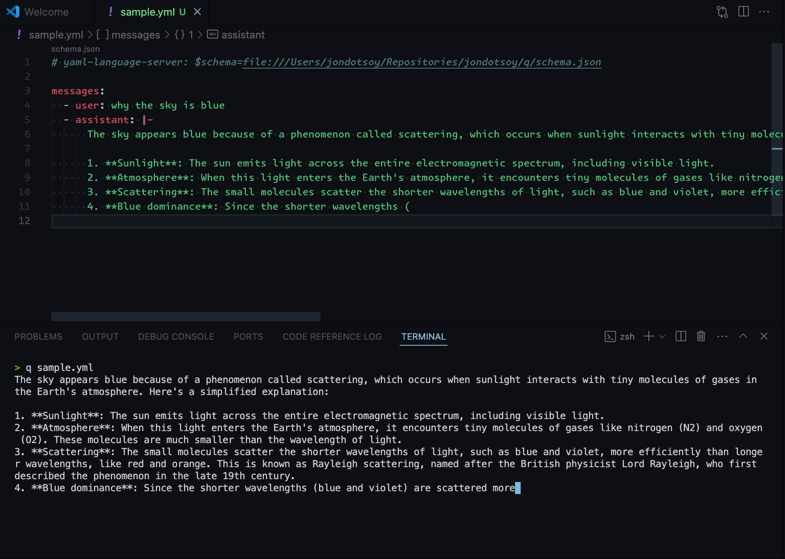

# Project Cofy: Simplifying Conversational AI Development

Project Cofy is an open-source project that aims to simplify the task of working with artificial intelligence models, making it easier for developers and researchers to create and manage conversations using a YAML file directly. By providing a user-friendly interface through a text editor, Cofy eliminates the need for complex programming knowledge or APIs, streamlining the workflow for those working with conversation AI.

The inspiration behind Project Cofy is to make AI development more accessible to a wider range of users, from developers and researchers to students and hobbyists. By leveraging YAML files as a simple and intuitive input format, Cofy reduces the barrier of access, allowing users to focus on creating innovative conversations without having to struggle with complex code or APIs.

**Demo**

[](https://youtu.be/4lEQjqxf6gU)

**Content**

- [Installation](#installation)
- [Usage](#usage)
- [Manifest File Format](#manifest-file-format)

## Installation

To install Project Cofy, you can use Homebrew on macOS. Simply execute the following command in your terminal:

```
brew install jondotsoy/core/cofy
```

Alternatively, you can also install it locally on any system.

### Local Installation

Before installing Project Cofy, you need to have Bun.js installed on your system. You can download and install Bun.js from its official website: https://bun.sh

**Install**

Clone the repository:

```shell
git clone https://github.com/JonDotsoy/cofy-project.git
```

Install dependencies:

```shell
make install
```

Build the project:

```shell
make build
```

This will compile the binary in `./dist/cofy`.

## Usage

### Create a Conversation using a YAML File:

The manifest file in YAML format can contain the following structure:

```yaml
# manifest.yaml
messages:
  - system: |
      You are an expert at creating short jokes.
  - user: |
      Tell me a joke
```

This file describes a conversation with the AI, within `messages` you control the flow of the conversation, write what says the role of `system`, `assistant` and `user`.

**Run Cofy:**

After creating the file, you can run `cofy` to continue the conversation with the AI.

```shell
cofy manifest.yaml
```

Cofy will process the YAML file and respond with a message based on the flow of conversation defined.

```yaml
messages:
  - system: |
      You are an expert at creating short jokes.
  - user: |
      Tell me a joke
  - assistant: |-
      Here's one:

      Why couldn't the bicycle stand up by itself?

      (Wait for it...)

      Because it was two-tired!

      (get it?)
```

### Run a Conversation Saved

There are agents that you can run quickly from [Cofy Github](https://github.com/JonDotsoy/cofy/tree/develop/agents) a repository in Github or from your local machine.

The following example downloads the agent from https://github.com/JonDotsoy/cofy/blob/develop/agents/commit-message.agent and processes locally to create an automatic message for saved conversations.


## Manifest File Format

For more information about the manifest file format, you can check out [manifest.md](./docs/manifest.md).

## Roadmap

To see upcoming improvements to this project, read the [ROADMAP](./ROADMAP.md) file.
